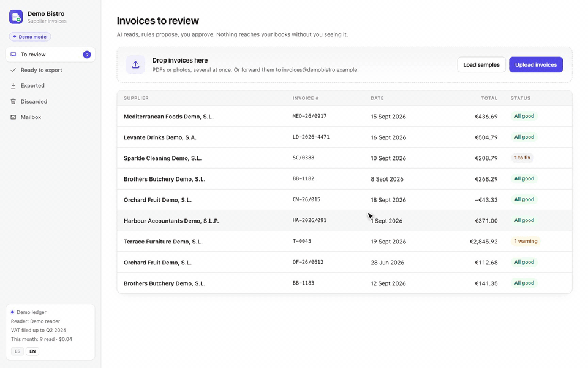

<div align="center">


# Asienta

Reads supplier invoices with an AI model and turns them into journal entries<br>
for **Sage 50, ContaPlus, A3, Holded, Xero, QuickBooks** or plain CSV.




<sub>The demo app, fictional data · [MP4](docs/media/demo.mp4) · [Español](README.es.md)</sub>

</div>

## What it does

1. **Collects invoices** from an email inbox, a watched folder, drag & drop, the phone camera or an HTTP API.
2. **Reads each one** with the AI model you choose, into a fixed schema: supplier, tax ID, number, date, lines, VAT.
3. **Proposes the entry** from your own ledger: which supplier, which expense account, how to split the lines, which posting date.
4. **Checks it**: tax-ID check digits, sums, VAT against the rate, duplicates, dates in a VAT quarter already filed.
5. **You approve**, and it writes one file your accounting software imports.

The model only does step 2. Everything else is plain code, so every proposal can be explained and tested, and the model can be swapped.

## Works with

| Accounting software | AI models | Your ledger, read from | Invoices in by |
|---|---|---|---|
| Sage 50 · XDIARIO import | Google Gemini | CSV exports (any program) | Email (IMAP) |
| Sage 50 · Excel importer *(beta)* | Anthropic Claude | Sage 50 / ContaPlus accounts export | Watched folder |
| ContaPlus *(beta)* | OpenAI | Sage 50 live, read-only (SQL Server) | Drag & drop |
| a3ASESOR eco / con *(beta)* | Any OpenAI-compatible API: Mistral, OpenRouter, Azure… | | Phone camera |
| Holded *(beta)* | Local: Ollama, LM Studio, vLLM | | HTTP API |
| Xero · QuickBooks Online *(beta)* | | | |
| CSV · JSON | | | |

*Beta* formats follow each program's published import format and are covered by tests, but haven't been imported into the real program yet. Try a test company first, and [report how it went](https://github.com/73bruno/asienta/issues/new?template=exporter.md).

## Try the demo

```bash
pip install "git+https://github.com/73bruno/asienta"
asienta --demo
```

A fictional business with its ledger and a month of invoices, at `http://localhost:8760`. No API key needed. Click **Load samples**, or **Mailbox › Send a test email** to see a forwarded receipt photo arrive.

## Use it with your data

```bash
asienta init             # creates config.ini and a ledger/ folder with example CSVs
asienta check            # tests the AI model and the ledger connection
asienta                  # http://localhost:8760
```

Everything is chosen in `config.ini`:

```ini
[reader]
provider = gemini              ; gemini | claude | openai | ollama
model = gemini-3.8-flash       ; key in GEMINI_API_KEY, ANTHROPIC_API_KEY or OPENAI_API_KEY

[ledger]
source = csv                   ; csv | sage50 (live, read-only)

[export]
format = sage50                ; sage50 | contaplus | sage50xls | a3 | holded | xero | quickbooks | csv | json

[inbox]
folder = ~/Dropbox/Invoices    ; optional; [mailbox] for an IMAP inbox
```

To run the model locally, so invoices never leave your network:

```ini
[reader]
provider = ollama
model = llama3.2-vision
```

Guides: [AI models](docs/ai-models.md) · [ledger](docs/ledger.md) · [exporters](docs/exporters.md) · [email](docs/mailbox.md) · [folder and API](docs/api.md) · [deploying](docs/deploy.md) · [customizing](docs/customizing.md)

## Add your own

Readers, ledger sources and exporters are small classes registered in a dictionary. A complete exporter:

```python
class MySoftware(Exporter):
    key, label, extension = 'mysoftware', 'My Software (CSV)', '.csv'

    def write(self, path, invoices, ctx):
        def build(_i, data, entry, supplier):
            return [[data['invoice_number'], entry['posting_date'], entry['supplier_account'],
                     account, rate, f'{base:.2f}', f'{vat:.2f}']
                    for account, rate, base, vat in split_vat(data, entry)]
        result, rows = self.each(invoices, ctx, build)
        with open(path, 'w', newline='') as f:
            csv.writer(f, delimiter=';').writerows(rows)
        return result
```

Once registered, the existing tests run it against every demo invoice. More in [extending](docs/extending.md).

## How it decides

- **Supplier**: by tax ID in your ledger, then by name. Pick one by hand once and it remembers.
- **Account**: the one this supplier's invoices went to most this year, shown with the reason.
- **Split**: the model tags each line with a category (food, drinks, cleaning… your own list) and each category has an account. The wine on a food invoice goes to drinks.
- **Date**: the invoice date, unless that VAT quarter is already filed. Then it moves to the first open day.
- **Checks**: a tax ID that fails its check digit gets a one-click fix from your ledger. Totals, VAT, future dates, duplicates, withholding and possible fixed assets are flagged before approval.

To compare models on your own invoices, `asienta bench` counts the fields each one gets wrong and how many of those no check warned about. [How it works →](docs/how-it-works.md)

## Performance

| | |
|---|---|
| AI reading | ~5 s per invoice with Gemini Flash, three in parallel, in the background |
| Rules and checks | ~2 ms per invoice |
| Export | 1,000 invoices in under 0.25 s |
| Memory / start-up | 26 MB / under 0.5 s |
| Package | 240 KB, no dependencies: standard-library Python, SQLite, plain JavaScript |

Measured on an Apple M1; run `python scripts/speed.py` on yours. Only the AI reading costs money: under one cent per invoice with Gemini Flash, nothing with a local model.

## Good to know

- Tax logic is Spanish (NIF/NIE/CIF, IVA, IRPF, equivalence surcharge). Other countries need their own module; the rest of the pipeline doesn't depend on it.
- It reads your ledger and never writes to it. It listens on localhost; anything else needs an access token or Tailscale.
- The interface is in English and Spanish, light and dark, and can carry your own name, colour and logo.

## License

[MIT](LICENSE): free for any use, commercial included. Contributions welcome, especially exporters for other programs and reports from real imports. See [CONTRIBUTING.md](CONTRIBUTING.md).

<sub>Sage 50, ContaPlus, a3ASESOR, Holded, Xero, QuickBooks and the AI providers named are trademarks of their owners. This project isn't affiliated with any of them.</sub>
