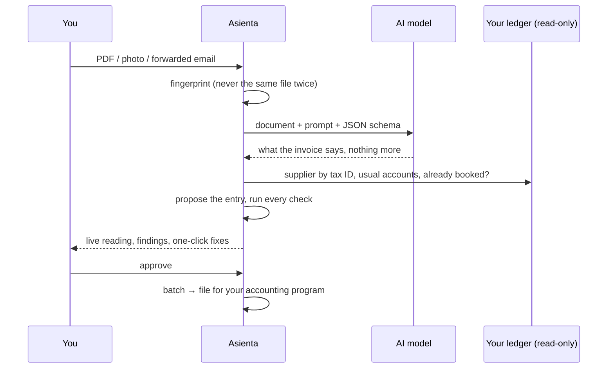

# How it works

Asienta turns a supplier invoice into a journal entry in five steps. Only the first one uses AI.

## 1. Intake

Documents arrive by upload (drag & drop, file picker, phone camera) or from an IMAP mailbox that
Asienta checks every few minutes ([setup](mailbox.md)). Every file is identified by its SHA-256, so the same PDF sent
twice is recognised, and files are accepted only if their **bytes** say PDF or image (15 MB max).

The mailbox has one detail worth knowing: when someone forwards an invoice, the original sender's
signature travels with it (logos, social icons). Those are **set aside** before spending a reading
on them — by content ID, size, pixel dimensions or name — but never deleted: the Mailbox screen
lists them with the reason and an "It's an invoice" button in case the filter was wrong.

## 2. Reading (the only AI step)

The model receives the document, a prompt that describes the company and its line categories, and
a strict JSON schema (`asienta/extraction/schema.py`). It must return, per invoice in the file:

| Field | Notes |
|---|---|
| `doc_type` | `invoice`, `credit_note` or `other` (delivery notes, quotes…) |
| `supplier_name`, `supplier_tax_id` | The issuer, never your company |
| `invoice_number`, `invoice_date`, `accounting_date` | A second date only if the paper shows one |
| `lines[]` | description, amount, VAT rate and **category** (from your `[categories]`) |
| `vat_breakdown[]` | one entry per VAT rate, as printed |
| `surcharge`, `withholding`, `total`, `due_dates[]` | |
| `possible_asset` | furniture, machinery, works: might belong in fixed assets |
| `suggested_account` | from the accounts your ledger used this year, for new suppliers |
| `notes[]` | anything unreadable or ambiguous, in one short sentence |

Then `normalize()` makes the answer safe: numbers in any format, dates to ISO, tax IDs without
`ES-` and dots, rates merged, and **credit notes signed consistently** (paper often prints positive
bases with a negative total).

Readers are pluggable ([AI models](ai-models.md)): **Gemini** over plain REST, **Claude** through
the official SDK, **any OpenAI-compatible API** (OpenAI, Mistral, OpenRouter, Azure, or a local
model through Ollama, LM Studio or vLLM), and a **demo** reader that replays stored readings.

## 3. Proposal (rules, `asienta/rules.py`)

1. **Supplier**: the one you picked by hand › a tax-ID rule you taught it › by tax ID in the ledger
   › by name (ignoring S.L., accents…) › by a very similar name, only if unambiguous.
2. **Main account**: the one you fixed for that supplier › the one it used most this year
   (`"the usual one with this supplier (86 % of this year)"`) › the AI's suggestion.
3. **Split by line**: if the main account is a purchases account (`600…`), each line goes to its
   category's account. What doesn't match any line (shipping, fees) goes to the largest account; a
   global discount is spread proportionally. Some categories can *follow* the main account: keg and
   crate deposits on a drinks invoice stay with the drinks.
4. **Posting date**: the invoice date, unless that quarter's VAT is already filed; then the first
   day of the first open month. The filed quarter is computed from the Spanish deadlines (20 April,
   July, October; 30 January) or set by hand.

Every reason is stored as a message code, so the interface explains itself in Spanish or English.

## 4. Checks (`asienta/checks.py`)

Each finding is an **error** (blocks approval), a **warning** or an **info**, and many come with a
one-click fix.

| Group | What is checked |
|---|---|
| Document | not an invoice? credit note? |
| Supplier | found? matched by name only? several accounts share the tax ID? tax ID missing, yours, invalid or different from the ledger's |
| Number & dates | number present, two dates on the paper, closed quarter, future or very old date |
| Amounts | base × rate = VAT, bases + VAT + surcharge − withholding = total, lines vs bases |
| Split | every line has an account, accounts exist and are expense/asset accounts, split sums match the bases per rate |
| Duplicates | same number in the app, or already in the ledger's VAT book (by number, or same base in the same month) |
| Reading | every note the model wrote |

### Silent errors

A wrong value **with** a warning is fine: the reviewer sees it. A wrong value **without** one goes
straight to your books. So Asienta measures itself by silent errors, and several checks exist only
to turn silent errors into visible ones. The best example is the tax ID: thermal printers and phone
photos make digits look alike (8 ↔ 6, 1 ↔ 7, B ↔ 8). A misread ID almost always fails its check
digit, and `spain.tax_id_candidates()` tries every one-character confusion to find the valid one —
preferring the one your ledger already has for that supplier. The reviewer gets a *"Use B87654323"*
button instead of a typo in the books.

`asienta bench` runs this measurement on your own invoices against a hand-checked truth file and
reports, per model, fields read right, perfect invoices, supplier/account accuracy, cost, time and
silent errors.

## 5. Review, learning and export

Approving saves what you taught it: a supplier picked by hand links its tax ID for next time, and
"always use this account" fixes the account for that supplier. Approved invoices are exported
together in one **batch** in the format of your choice ([exporters](exporters.md)); a batch can
be downloaded again or undone until it has been imported. When the ledger later shows those
invoices in its VAT book, they move to *booked* on their own.

## Design choices

- **Read-only towards your books.** Nothing is written into your accounting database. Entries go
  in through your program's own importer, which keeps its own history and undo.
- **One invoice never half-exported.** Every exporter builds balanced postings first; an invoice
  that can't be exported cleanly (a VAT rate without an account, a surcharge the format can't
  carry) is left out whole, with a warning, and stays ready for the next batch.
- **No framework, no build, no database server.** Standard-library Python, SQLite, one HTML file,
  one CSS file, one JS file. It runs on the office PC that already runs the accounting software.
- **Invoice text is data.** It is always rendered as text, never as HTML.
